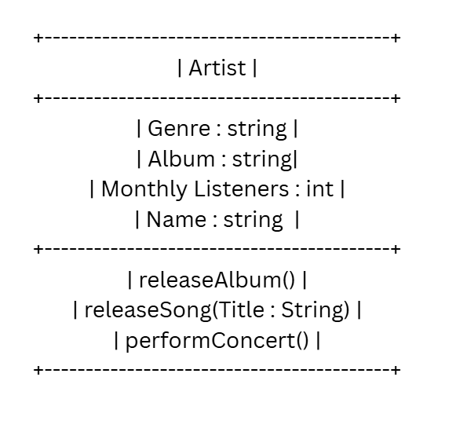

# SG4 - Understanding Classes and Objects
## Artist
## a person who creates, performs, or expresses original ideas through musical art
## Properties
| Property | Data Type | Description |
|---|---|---|
|Genre |string |a category of music |
|Album |string |a collection of audio recordings |
|Monthly Listeners |int |the total amount of listeners per month |
|Name |string |Name of artist |
## Methods
| Method | Description |
|---|---|| | |

|releaseAlbum()|Release a whole album with multiple tracks |
|releaseSong(Title:string) |Release a single track |
|performConcert() |Perform an album or song |
## Class Diagram

## Design Explanation
### It models a real-world musician or group to hold all their info and actions in one place.
### It identifies who the artist is so you can link their songs, albums, and listeners to them.
### releaseSong(Title : String) — Releasing tracks is what artists do most often to add new music and attract listeners.
