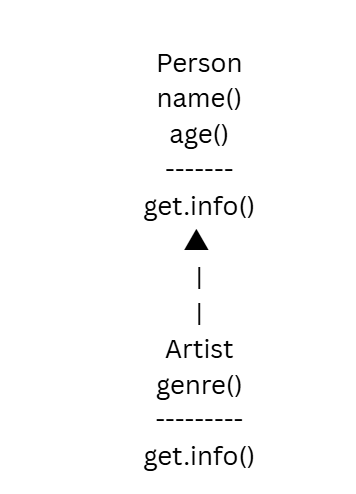
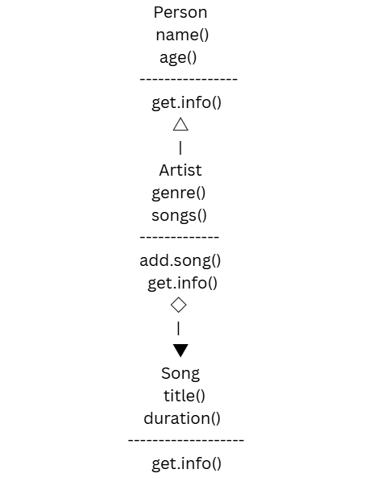
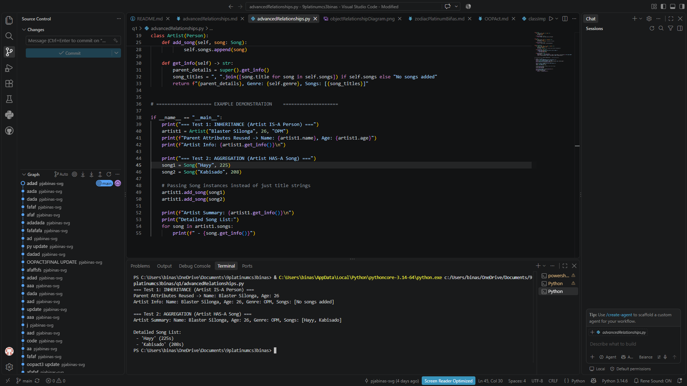

# Advanced Class Relationships
## Previous Activities
[classAttrib](classAttributesMethods.md)
[classRel](classRelationships.md)
## Existing System Description:
## Inheritance Relationship
Parent: `Person`
Child: `Artist`
Explanation: An `Artist` **IS-A** `Person` . In here, `Artist` inherits the attributes (`name`, `age`) and methods (`get_info()`) of the `Person` class. It also has its own specialized attributes like `genre` and methods to manage tracks.
## Inheritance UML

## Composition/Aggregation
Relationship: Aggregation (Weak HAS-A)
Explanation: An `Artist` **has-a** list of `Song` objects. This is modeled as Aggregation because a `Song` object can be instantiated independently of a `Artist` object (created outside the artist and passed to the artist via `add_song()`), so deleting the artist will not destroy the song object.
## Advanced UML Diagram

## Python Implementation
[Source Code](advancedRelationships.py)
## Test Run

## Object Diagram

## Reflection
Answers:
