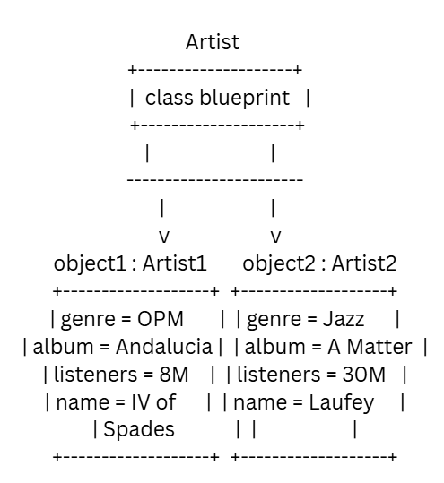

# Class Attributes and Methods
## Previous Design
[OOPACT.md](OOPAct.md)
## Design Revision
Describe any changes made to your original class.
## Visibility Decisions
| Attribute | Data Type | Visibility | Reason |
|---|---|---|---|
|+Genre| String | Public | This is a general attribute that can be accessed from outside the class|
|+Album| String | Public | This is a general attribute that can be accessed from outside the class|
|+Monthly listeners| Integer | Public | This is a general attribute that can be accessed from outside the class|
|+Name| String | Public | This is a general attribute that can be accessed from outside the class|
|-Adress| String | Private | This is a sensitive attribute that should not be accessed from outside the class|
|-Earnings| int | Private | This is a sensitive attribute that should not be accessed from outside the class|

## Updated UML Class Diagram

## Python Implementation

[View Python Source](classImplementation.py)
## Test Run

## Object Diagram

## Analysis
### 1. I made the Address and Earnings attribute private because they are sensitve and personal information about the artist. These attritubes should not be accesed or changed by other people.
### 2.The addListeners method changes the state of the object because it increases the number of monthly listeners for the artist. The attribute affected is Monthly_listeners and when this method is called it adds the specified amount to the current number of listeners.
### 3. The 2 objects demonstrated that the instance are independent because when I call the addListeners method to an artist object it only affects that specifict object and not the other. For example when i call to add 1,000,000 listeners to artist1 it does not affect artist number 2.
### 4. The class diagram show the structure of the class and its attributes and methods, while the object diagram shows the specific instances of the class and their current state. In my class, the class diagram would show the Artist class with its attributes and methods, on the other hand the object diagram shows the specific isntances of the artist class and their current values for the attributes. example, artist1 has a genre of Opm, an album of Andalucia, and 8,000,000 monthly listeners, while artist2 has a genre of Jazz, an album of A matter of Time, and 30,000,000 monthly listeners.                                                           