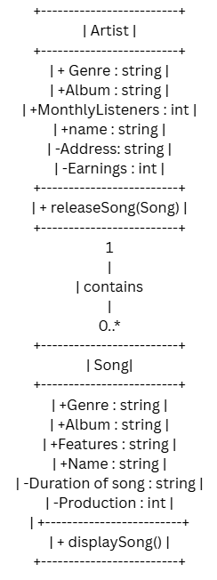
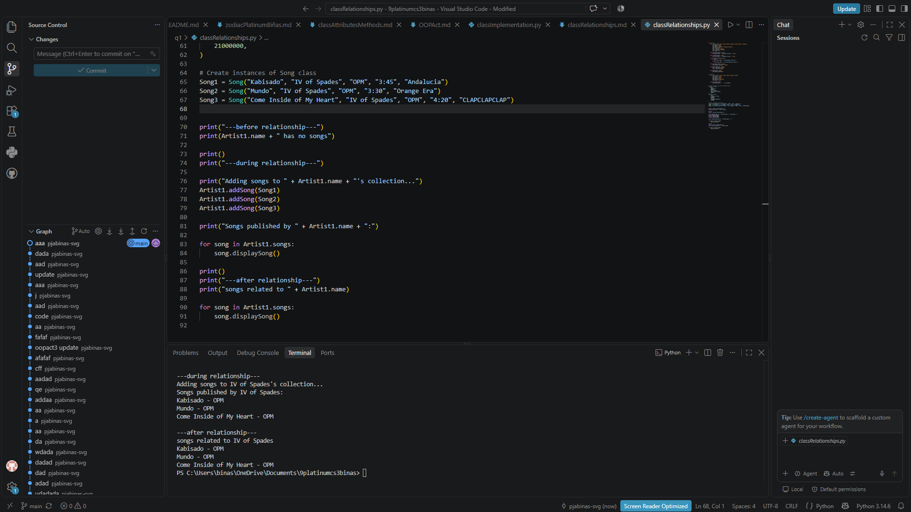
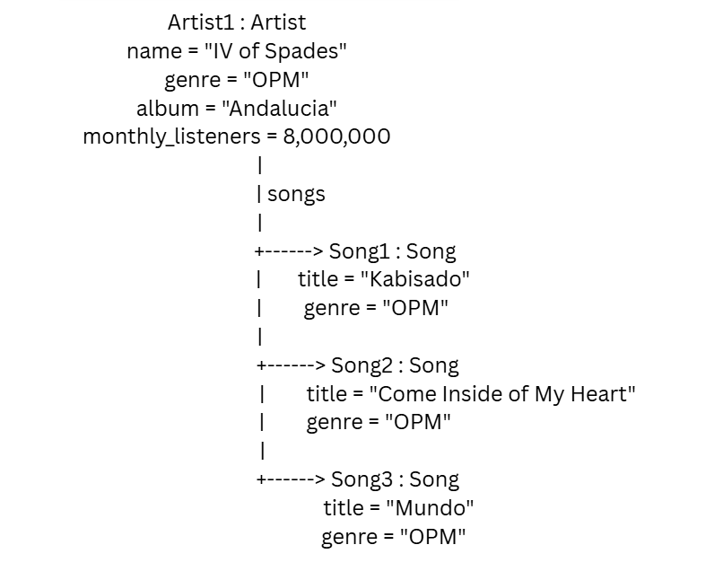

# Class Relationships: Association and Multiplicity
## Previous Work
[Part I - Classes and Objects](OOPAct.md)
[Part II - Class Attributes and Methods](classAttributesMethods.md)
## Existing Class
Class: Artist
Description: A person who creates, performs, or expresses original ideas through musical art. Through musical instruments, production, vocals that shape the musical piece.
## New Related Class
Class: Song
Description:  a short musical composition intended to be sung by the human voice, typically combining melody, rhythm, and lyrics
## Association
Relationship: Artist HAS-A Song
Explanation: An Artist HAS-A Song relationship means that an artist contains one or more Song object, representing ownership or creation within the system or relationship
## Multiplicity
Multiplicity: Artist 1 ───────── 0..* Song
Explanation: An Artist can have 0 song or many songs
## UML Class Relationship Diagram

## Python Implementation
[View Python Source](classRelationships.py)
## Test Run

## Object Relationship Diagram

## Analysis
### What is the association between your two classes?
An Artist HAS-A Song relationship this mean that a artist can contain one or more songs or no songs
### What multiplicity did you choose and why?
An artist may have 0 songs or many songs
### How did you implement the relationship in Python?
I implemented the relationship by adding a song list inside a Artist class. I used the addSong() to add a Song objects to the list
### Why did you store an object reference instead of copying its data?
I stored the object reference so that the artist can directly acces the Song object and the information.
### If your relationship uses many, why is a list appropriate?
A list is appropriate because one Artist can have many Song objects. The list can store multiple songs, such as Kabisado, Come Inside of My Heart, and Mundo.
